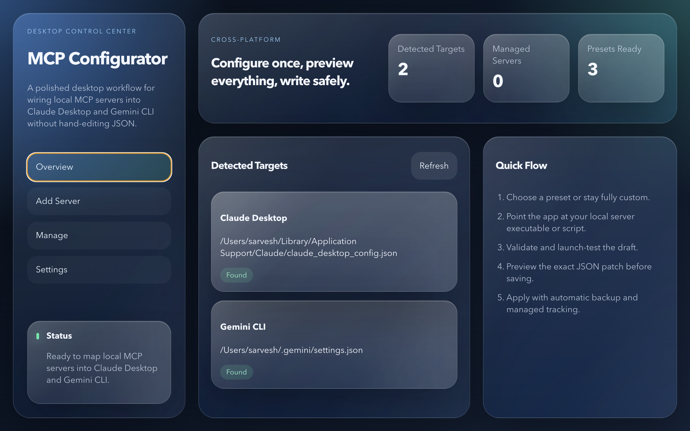

# MCP Configurator

✨ A cross-platform desktop app for setting up local MCP servers for Claude Desktop and Gemini CLI without hand-editing JSON.



## 🚀 What This Tool Does

MCP Configurator helps you connect already-downloaded MCP servers to desktop AI tools in a safer, faster, and more visual way.

Instead of manually hunting for config files, editing JSON by hand, and hoping the command works, this app gives you a guided desktop workflow for configuring, validating, previewing, and applying MCP server entries.

## 🎯 Who It’s For

- 🧑‍💻 Developers testing local MCP servers
- 🤖 AI power users working with Claude Desktop
- 🛠️ Builders using Gemini CLI with custom tool integrations
- 📦 Anyone who wants a friendlier setup flow than raw config editing

## 🧩 Core Features

- 🔍 Auto-detects Claude Desktop and Gemini CLI config locations
- ➕ Adds new MCP server entries with preset or fully custom setup flows
- 🧪 Validates command paths, args, environment variables, and config shape
- ▶️ Runs lightweight launch tests before applying changes
- 👀 Shows a preview of the config patch before writing anything
- 💾 Creates timestamped backups before every config update
- 📝 Tracks managed server entries so they can be edited, re-tested, or removed later
- 🖥️ Ships for macOS, Windows, and Linux

## 🛡️ Why It’s Useful

- No more manual JSON editing
- No more guessing where config files live
- No more silent config mistakes
- Safer changes with preview + backup built in
- Better visibility into what was added and where

## 📍 Supported Targets

- Claude Desktop
- Gemini CLI

## 🧠 Current Product Scope

- ✅ Configure local MCP servers that are already installed or downloaded
- ✅ Support custom commands, arguments, working directory, and env vars
- ✅ Preview and apply config updates safely
- ✅ Generate release builds for 🍎 macOS Apple Silicon DMG
- ✅ Generate release builds for 🪟 Windows x64 installer
- ✅ Generate release builds for 🐧 Linux x64 AppImage and `.deb`

The app currently focuses on configuration and validation.
It does **not** install MCP servers for the user.

## 🏗️ Tech Stack

- ⚛️ React 19
- 🧱 Electron
- 🟦 TypeScript
- ⚡ Vite
- 📦 electron-builder

## 🧪 Local Development

```bash
npm install
npm run dev
```

## 📦 Build Commands

Build everything:

```bash
npm run package
```

Build per platform:

```bash
npm run package:mac
npm run package:win
npm run package:linux
```

## 🔄 CI / CD

- ✅ Pushes and pull requests to `main` run CI automatically
- ✅ Version tags like `v0.1.5` trigger release packaging
- ✅ GitHub Actions builds release artifacts for macOS, Windows, and Linux

Workflow files:

- `.github/workflows/ci.yml`
- `.github/workflows/release.yml`

## 📌 Notes

- Claude Desktop config paths are resolved per platform
- Gemini CLI currently defaults to `~/.gemini/settings.json` unless overridden in the app
- Unsigned macOS builds may still show Apple Gatekeeper warnings until signing + notarization is added

## 🤝 Status

The project is active and currently focused on making MCP server setup feel simple, safe, and desktop-native.
